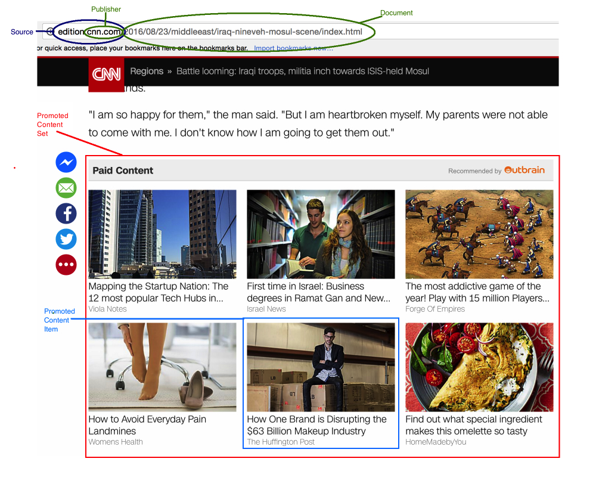

# ADS Project 5: 

Term: Spring 2017

+ Team #2
+ Projec title: Click or Not? Advertisement Recommendation 
+ Team members
	+ Bo Peng bp2494
	+ Ruochen Liu rl2841
	+ Zheren Tang zt2191
	+ Yini Zhang yz3005
	+ Zeyu Gan zg1145

+ Project summary: 

The internet is a stimulating treasure trove of possibility. Every day we stumble on news stories relevant to our communities or experience the serendipity of finding an article covering our next travel destination. Outbrain, the web’s leading content discovery platform, delivers these moments while we surf our favorite sites. Currently, Outbrain pairs relevant content with curious readers in about 250 billion personalized recommendations every month across many thousands of sites. 
 
This project aims to predict which pieces of content its global base of users are likely to click on. The dataset contains numerous sets of content recommendations served to a specific user in a specific context. Each context (i.e. a set of recommendations) is given a display_id. In each such set, the user has clicked on at least one recommendation. Our task is to rank the recommendations in each group by decreasing predicted likelihood of being clicked.



	
**Contribution statement**: ([default](doc/a_note_on_contributions.md))

	+SQL Cloud Database Setup (AWS with MS SQL Server): Bo Peng, Yini Zhang

	+SQL Queries: Yini Zhang, Ruochen Liu, Bo Peng

	+Data Cleaning: Yini Zhang, Bo Peng, Zheren Tang, Zeyu Gan

	+Logistic Regression: Ruochen Liu, Zheren Tang

	+Git Repo: Bo Peng, Yini Zhang

	+Presentation: Zeyu Gan 

All team members contributed equally in all stages of this project. All team members approve our work presented in this GitHub repository including this contributions statement. 

Following [suggestions](http://nicercode.github.io/blog/2013-04-05-projects/) by [RICH FITZJOHN](http://nicercode.github.io/about/#Team) (@richfitz). This folder is orgarnized as follows.

```
proj/
├── lib/
├── data/
├── doc/
├── figs/
└── output/
```

Please see each subfolder for a README file.
