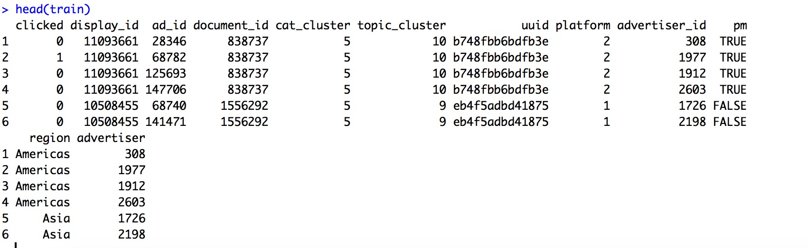

##  **(1)Problem Description**

* The internet is a stimulating treasure trove of possibility. Every day we stumble on news stories relevant to our communities or experience the serendipity of finding an article covering our next travel destination.
* We are challenged to predict which pieces of content its global base of users are likely to click on.

## **(2)Data**

* Data comes from Kaggle.com
* Raw data includes Content of websites, information of users who browsed the website and information of ads on the websites.
* Data contains all kinds of information, which is challenging and interesting.

* Given the information of website, users and ads on the website, We will predict the probility of each ad being clicked and use Mean Average Precision to evaluate the result.

## **(3)First Attempt**

* Firstly we tried a relatively Bayesian method which focus on the click itself.

* R is the average clicked rate of an ad.
* v is the times an ad was displayed.
* C is the mean clicked rate around all ads in the data.
* m is the minimum displaying times required for an ad.

* The method is very efficient and the result is not bad.

## **(4)Advanced Exploation**
* We want to use more information in the dataset to get a more precise result.
* Logistics Regression is a good way to predict probility.

### **Data Processing**

* The raw data is way too large to process in R. SQL is the only choice.
* Delete unrelative information
* Use k-means cluster to reduce the number of catagories in data.

### **Variable Selection**

* After processing, there still are plenty of variables.
* Since regression includes matrix calculation, we still need to select necessary variables to reduce calculation time.
* Backward selection is applied to select variables.

### **Result**

## **(5)Summary**
* We use two methods to predict which ad will be clicked, both of them give us ideal result.

